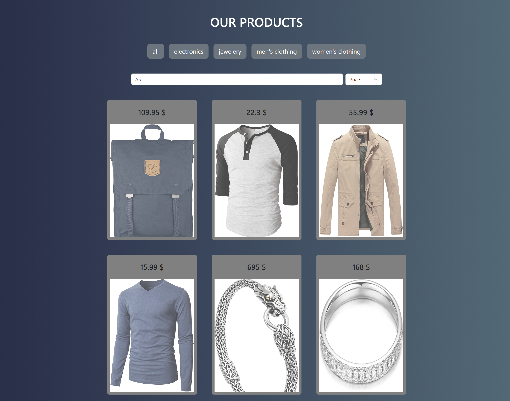

# Product List

This project is a React application that allows users to filter products by category, sort them by price or name, and search for products using a search bar. The application is responsive and user-friendly.

## Features

- Category Filtering: Filter products based on categories.
- Product Search: Search for products by their title.
- Sorting: Sort products by price or name.
- Responsive Design: Built with Bootstrap for a mobile-friendly layout.

## Tech Stack

**React**: For building the application structure.

**SASS**: For styling and managing CSS more efficiently.

**Bootstrap**: For responsive UI components.

**JavaScript**: For dynamic functionalities.

## Installation

Install my-project with npm

## Available Scripts

In the project directory, you can run:

### `yarn start`

Runs the app in the development mode.\
Open [http://localhost:3000](http://localhost:3000) to view it in your browser.

The page will reload when you make changes.\
You may also see any lint errors in the console.

### `yarn test`

Launches the test runner in the interactive watch mode.\
See the section about [running tests](https://facebook.github.io/create-react-app/docs/running-tests) for more information.

### `yarn build`

Builds the app for production to the `build` folder.\
It correctly bundles React in production mode and optimizes the build for the best performance.

The build is minified and the filenames include the hashes.\
Your app is ready to be deployed!

See the section about [deployment](https://facebook.github.io/create-react-app/docs/deployment) for more information.

### `yarn eject`

**Note: this is a one-way operation. Once you `eject`, you can't go back!**

If you aren't satisfied with the build tool and configuration choices, you can `eject` at any time. This command will remove the single build dependency from your project.

Instead, it will copy all the configuration files and the transitive dependencies (webpack, Babel, ESLint, etc) right into your project so you have full control over them. All of the commands except `eject` will still work, but they will point to the copied scripts so you can tweak them. At this point you're on your own.

You don't have to ever use `eject`. The curated feature set is suitable for small and middle deployments, and you shouldn't feel obligated to use this feature. However we understand that this tool wouldn't be useful if you couldn't customize it when you are ready for it.

    
## Project Structure
`
src
├── components
│   ├── Header
│   │   ├── Header.js
│   │   └── Header.scss
│   ├── Products
│   │   ├── ProductCard.js
│   │   ├── ProductList.js
│   │   └── Products.scss
├── helper
│   └── data.js
├── App.js
├── App.scss
`
## How to Use

1. Filter Products by Category
Click on any category button on the main page to filter products.
2. Search Products
Type a product name in the search bar to display matching results.
3. Sort Products
Use the dropdown menu to sort products by "Name" or "Price."
## Screenshots

## 🚀 About Me
I'm a Recep Demir
https://github.com/recep-demir

## Future Enhancements

- Add a shopping cart feature.
- Implement more advanced filtering options.
- Integrate with a backend for dynamic data.
